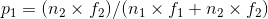

# Innovation Initation Model

## Why a temporary repository?
In this temporary repository, we will share our model two-step model for Innovation Initiation process.
We created this temporary repo because of anylogic's very restricting End User Agreement which applies to all models created with anylogic. Based on this license it was not possible for us to share the model in [OpenABM Computational Model Library](https://www.comses.net/codebases/) under open-source licenses available in that library. On the other hand, we wanted to follow the rules for anonymous peer review policy of [JASSS](http://jasss.soc.surrey.ac.uk/JASSS.html). Therefore, we decided to first share this model in this temporary repository and after acceptance, we will move the model to our personal github repos.

## Model description:
Here we will briefly describe our model based on ODD protocol (see [here](https://link.springer.com/chapter/10.1007/978-3-319-66948-9_15)).

### Overview:

#### 1. Purpose:

In this research a two step model is presented for studying innovation initiation process within different network structures. The aim of this model is to present a basis for understanding the dynamics of innovation initiation and also to provide a tool for investigating the effect of different network structures and policies on the systems innovation related performance. The model can be useful for both researchers, as a basis for studying innovation initiation process with a computational approach, and also policy-makers to rethink their strategies for policy interventions.

#### 2. Entities, state variables and scales:

Entities of the model are agents that represent firm's competing with each other in their network. Two states defined for each agent are called "Company" and "status" in the model. Based on Company state chart, each agent regarding to its level of innovation activity, can be in one of three states of Ordinary, Innovative and Successful. Ordinary agents represents the firms that are not investing greatly in innovation activities, Innovative agents are the ones that are trying to present a successful innovation and are investing resources to achieve to this goal and Successful agent are firms which have presented that successful innovation and are benefiting from it. In addition to mutation rate, transitions between Ordinary and Innovative states can also happen based on a probability we call transitional probability which is dependent to the relative frequencies of different connected agents' type for each agent i. Therefore if agent i has more connections in Innovative state, the transitional probability from Ordinary to Innovation state will be higher for it. At each time step, agents with the probability of Decision rate, v, enters the situation in which it should reconsider its innovation strategy (between being Ordinary or Innovative). This process is presented by Status state chart in which agent's state with probability of v will change from "Alive" to "Dead" and oncee they entered "Dead" state, mutation process starts and after that agents will return to "Alive" state. Simulations will continue until the first agent enters the Successful state.

#### 3. Process overview and scheduling:

At first based on the selected network structure, each agent will connect to others and all agents will be in the Ordinary state. At each time step, with the probability of Decision rate, v, each agent enters the situation in which it should rethink its strategy (between being Ordinary or Innovative). This probability will be calculated again at each time step before agents decision making process. Also at each time step, each agent might mutate to the next state based on the rate called Mutation rate, u. Back-mutations is not considered in the model. Once the first agent entered Successful state, time will be saved in the outcome file and new simulation will start until it reaches the predefined number of simulations.

### Design concepts:

#### 4. Design concepts:

**Basic principals**. -- Dynamics of the presented model is based on the Knudson's two-hit cancer initiation model for retinoblastoma. Innovation clusters theory which are based on the assumption that local connections will boost innovation in firms and concepts like geographically localised knowledge spillover which support the idea of having local connections will result in a better innovative performance are some of the basic principals that this research is based on (see the original paper for more detailed explanations).

**Emergence**. -- The distribution of innovativenss within the network based on agents interaction with each other which results in creating innovative clusters.

**Sensing**. -- Agents are aware of their connections' strategies and their performances (fitness).

**Interaction**. -- Each agent will interact with its connections and we select its strategy (Ordinary or Innovative) based on its connections' strategies.

**Stochasticity**. -- Agents will enter the decision making stage with a give probability of v at each time step and will select their strategies based on a probability which is proportional to their connections' state and fitness. Furthermore, at each time step, each agent will mutate using a given probability of u.

**Observation**. -- Innovation initiation time or in other words the time until first successful innovation emerge in the network will be recorded in different scenarios.

### Details:

#### 5. Initialisation

For all different series of experiments, initial population is equal to N=2500 and Decision rate will be v=0.2. All agents will be in the Ordinary state at the beginning of the simulation. Depending on the what network structure is selected, agents will connect to others using the pre-defined AnyLogic algorithms in a way that average number of connections for each agent be equal to 8. For scale-free network initial parameter values are: m0=2 and m=4. Mutation rate is equal to u=10-4 for first series of experiments and is equal to u=10-5 for and third series of experiments. Mutation rate will vary in experiment two to find best network for different mutation rates. Fitness of different states for the first experiment will be as follows: f2=1 and f1 will change from 1 to 1.4. In the second series of experiments for neural intermediate mutant: f1=f2=1, and for disadvantageous intermediate mutant: f1=1.2 and f2=1. Neighbour link probability for small-world network will be equal to 0.95, however for the third experiment it will change for 0.5 to 0.98.

#### 6. Input data

In this paper the model dose not include any input of external data.

#### 7. Sub-models

Model parameters are listed in the following table.

|Parameter |Description                                              |
|----------|---------------------------------------------------------|
|N         |Number of agents in the population                       |
|u         |Mutation rate                                            |
|v         |Decision rate                                            |
|f         |Fitness for the state j                                  |
|pNL    |Probability of neighbour link for small-world network    |
|m0     |initial nodes for scale-free network creation process    |
|m         |scale-free network creation process parameter            |

**Imitation**. -- Agents will imitate each others' strategy who are connected to them. In each time step, with the probability of u, agents' strategy will be reconsidered. The imitation process is as follows: suppose agent i is deciding agent and is connected to n1 Ordinary agents with fitness f1 and n2 innovative agents with fitness f2. Then

,

where  p0 is the probability of selecting Ordinary state and p1 is probability of selecting Innovative state.

**Mutation**. -- At each time step, each agent with probability of u will mutate from its state to the next state regardless of its neighbours state. Mutation is the only way of reaching the successful state and back-mutations are not considered in the model.

## Simulations Prerequisites:
This model is created using AnyLogic v8.3.2, therefore in order to open, edit and run the model, one must have the following prerequisites  to be able to open the model  and run the simulations:

* **AnyLogic model development environment v8.3.2** is needed for opening, editing and running the model which can be download from [AnyLogic website](https://www.anylogic.com/downloads/). AnyLogic PLE is available at the website for free which
* **Java 2 Standard Edition 8.0 or later** is needed to run AnyLogic model development environment.
* **We recommend to have 4GB of memory and modern processor** for optimal performance.

## Using the model
In order to open and edit the model, .alp file and AnyLogic v8.3.2 or above is required. .alp file is a XML file that describes the model, therefore AnyLogic software is required to regenerate the model and Also its engine will is required to run the model.

The model is consisted of two agent types (Main and myAgents) and one experiment (Simulation). General functions which apply to all agents are defined in Main section and more agent specific functions and variables such Innovation state is defined in myAgents.

By running the simulation, following window will appear:

In this window, key parameters of the model can be modified. In this window users are also able to select network type and different experiment as described in the paper.

In addition to .alp file, there are other files available in the folder which are needed for running the model. These files are: Time.txt, Time.xlsx, logo.jpg and alphabet.xlsx. Please do not remove these files and clear the content of reset the content of Time.xlsx and Time.txt to its default after each use. Output of the model which is innovation initiation time (or second mutation time) will be stored in Time.xlsx file and can be used for regenerating the plots presented in the paper.

For more detail descriptions about using AnyLogic please refer to AnyLogic guides (e.g. [AnyLogic in Three Days: Modeling and Simulation Textbook](https://www.anylogic.com/resources/books/free-simulation-book-and-modeling-tutorials/)).

## License
The model is created using AnyLogic software and therefore will be licensed under [AnyLogic Model End User Agreement](https://www.anylogic.com/upload/license_agreements/anylogic-model-end-user-agreement.pdf).  
