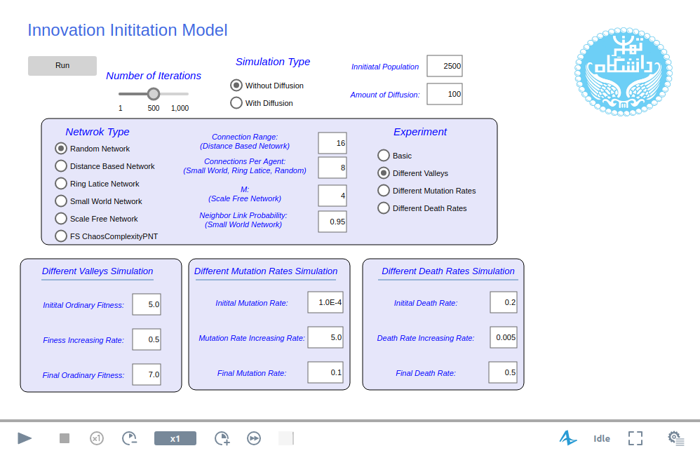

# Innovation Initation Model

## Simulations Prerequisites:
This model is created using AnyLogic v8.3.2, therefore in order to open, edit and run the model, one must have the following prerequisites  to be able to open the model  and run the simulations:

* **AnyLogic model development environment v8.3.2** is needed for opening, editing and running the model which can be download from [AnyLogic website](https://www.anylogic.com/downloads/). AnyLogic PLE is available at the website for free which
* **Java 2 Standard Edition 8.0 or later** is needed to run AnyLogic model development environment.
* **We recommend to have 4GB of memory and modern processor** for optimal performance.

## Using the model
In order to open and edit the model, .alp file and AnyLogic v8.3.2 or above is required. .alp file is a XML file that describes the model, therefore AnyLogic software is required to regenerate the model and Also its engine will is required to run the model.

The model is consisted of two agent types (Main and myAgents) and one experiment (Simulation). General functions which apply to all agents are defined in Main section and more agent specific functions and variables such Innovation state is defined in myAgents.

By running the simulation, following window will appear:

In this window, key parameters of the model can be modified. In this window users are also able to select network type and different experiment as described in the paper.

In addition to .alp file, there are other files available in the folder which are needed for running the model. These files are: Time.txt, Time.xlsx, logo.jpg and alphabet.xlsx. Please do not remove these files and clear the content of reset the content of Time.xlsx and Time.txt to its default after each use. Output of the model which is innovation initiation time (or second mutation time) will be stored in Time.xlsx file and can be used for regenerating the plots presented in the paper.

For more detail descriptions about using AnyLogic please refer to AnyLogic guides (e.g. [AnyLogic in Three Days: Modeling and Simulation Textbook](https://www.anylogic.com/resources/books/free-simulation-book-and-modeling-tutorials/)).

## License
The model is created using AnyLogic software and therefore will be licensed under [AnyLogic Model End User Agreement](https://www.anylogic.com/upload/license_agreements/anylogic-model-end-user-agreement.pdf).  
